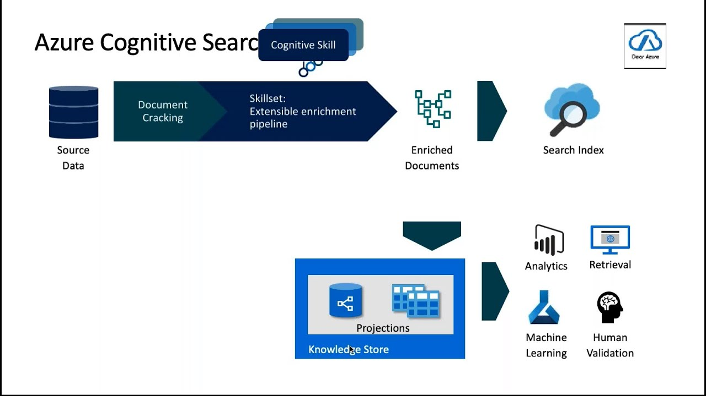
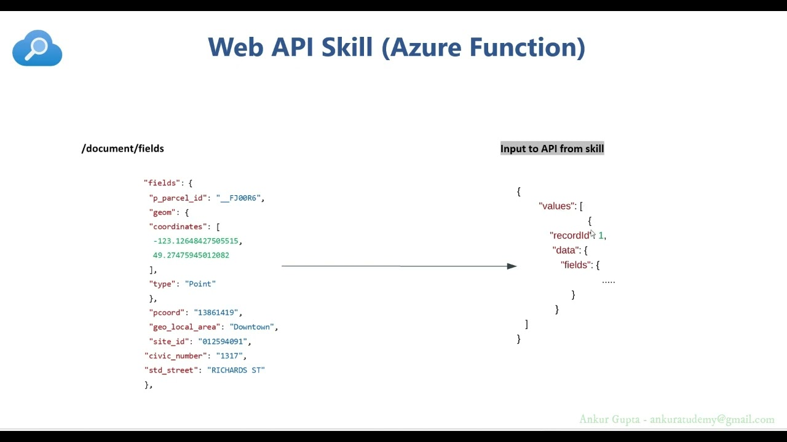

# Azure AI 검색 사용자 지정 기술 완벽 가이드

Azure AI 검색의 사용자 지정 기술(Custom Skills)은 기본 제공 AI 기술로는 충족할 수 없는 특별한 요구사항을 해결하기 위해 개발자가 직접 만들어 사용할 수 있는 확장 기능입니다. 문서 처리 과정에서 고유한 변환 작업이나 특화된 분석이 필요할 때 매우 유용한 도구입니다.[1]



## 사용자 지정 기술이란?

사용자 지정 기술은 Azure AI 검색의 AI 보강 파이프라인에 통합할 수 있는 **웹 API 엔드포인트**입니다. 기본 제공 기술과 동일한 방식으로 입력을 받고 출력을 생성하지만, 개발자가 직접 구현한 로직을 실행합니다.[2][1]

### 핵심 특징
- **외부 실행**: 검색 서비스 외부에서 실행되지만 기술 세트 내에서 다른 기술과 동일하게 작동[1]
- **표준 인터페이스**: JSON 형식의 입력을 받고 JSON 형식의 출력을 반환[3]
- **확장성**: 복잡한 비즈니스 로직이나 특화된 AI 모델을 통합 가능[4]


## 사용자 지정 기술의 활용 사례

### 실무 예시
- **업계별 분류 모델**: 비즈니스 문서와 재무 계약을 구별하는 맞춤형 분류[1]
- **음성 인식**: 오디오 파일에서 관련 콘텐츠를 추출하는 특화 기능[1]
- **단어 빈도 분석**: 문서에서 가장 자주 사용되는 단어를 식별[5]
- **엔터티 추출**: 특정 도메인에 특화된 엔터티 인식[6]

## 아키텍처 및 작동 원리

### 전체 워크플로
사용자 지정 기술은 Azure AI 검색의 인덱싱 파이프라인에서 다음과 같이 작동합니다:[7]

1. **데이터 수집**: 인덱서가 외부 데이터 소스에서 문서를 가져옴
2. **보강 처리**: 기술 세트가 문서에 AI 처리를 적용
3. **사용자 지정 기술 실행**: 외부 웹 API 호출을 통해 맞춤 로직 실행
4. **결과 통합**: 처리된 결과를 검색 인덱스에 저장

### 보강 문서 트리
모든 기술은 메모리상의 **보강 문서 트리**를 통해 작동합니다. 초기에는 `/document` 루트 노드로 시작하여, 각 기술 실행 후 새로운 노드가 추가되면서 구조가 확장됩니다.[7]

## 구현 방법

### 1. Azure Functions 사용 (권장)


Azure Functions는 사용자 지정 기술을 구현하는 가장 일반적인 방법입니다:[3][5]

```javascript
module.exports = async function (context, req) {
    if (req.body && req.body.values) {
        let vals = req.body.values;
        let res = {"values": []};
        
        for (let rec in vals) {
            let resVal = {
                recordId: vals[rec].recordId, 
                data: {}
            };
            
            // 사용자 지정 처리 로직
            let text = vals[rec].data.text;
            resVal.data.processedText = processText(text);
            
            res.values[rec] = resVal;
        }
        
        context.res = {
            body: JSON.stringify(res),
            headers: {'Content-Type': 'application/json'}
        };
    }
};
```

### 2. 기술 세트 구성
사용자 지정 기술을 기술 세트에 추가하는 JSON 구성:[2]

```json
{
    "@odata.type": "#Microsoft.Skills.Custom.WebApiSkill",
    "name": "my-custom-skill",
    "description": "사용자 지정 텍스트 처리 기술",
    "uri": "https://your-function-app.azurewebsites.net/api/your-function",
    "timeout": "PT30S",
    "batchSize": 1,
    "degreeOfParallelism": 1,
    "inputs": [
        {
            "name": "text",
            "source": "/document/content"
        }
    ],
    "outputs": [
        {
            "name": "processedText",
            "targetName": "processedContent"
        }
    ]
}
```

### 3. 호스팅 옵션
- **Azure Functions**: 이벤트 기반 서버리스 컴퓨팅[8]
- **Azure Web Apps**: 간단한 컨테이너화된 AI 기술[8]
- **Azure Kubernetes Service**: 복잡하거나 대규모 기술[8]

## 입력/출력 형식

### 입력 스키마
사용자 지정 기술은 다음과 같은 JSON 형식으로 입력을 받습니다:[5]

```json
{
    "values": [
        {
            "recordId": "a1",
            "data": {
                "text": "처리할 텍스트 내용",
                "language": "ko"
            }
        }
    ]
}
```

### 출력 스키마
처리 결과는 다음 형식으로 반환해야 합니다:[5]

```json
{
    "values": [
        {
            "recordId": "a1",
            "data": {
                "processedText": ["결과", "데이터"]
            },
            "errors": null,
            "warnings": null
        }
    ]
}
```



## 보안 및 인증

### 관리 ID 사용
Azure 관리 ID를 통한 안전한 연결이 가능합니다:[9][2]

```json
{
    "@odata.type": "#Microsoft.Skills.Custom.WebApiSkill",
    "uri": "https://your-function.azurewebsites.net/api/endpoint",
    "authResourceId": "api://your-app-id",
    "authIdentity": null
}
```

### 구성 요구사항
- 검색 서비스에 시스템 할당 관리 ID 구성[9]
- Azure Function 앱을 Microsoft Entra ID 로그인용으로 구성[9]
- 검색 서비스를 Function 앱의 허용된 클라이언트로 추가[9]

## 성능 최적화

### 배치 처리 설정
효율적인 처리를 위한 매개변수 조정:[8]

- **batchSize**: 한 번의 기술 호출에서 처리할 레코드 수
- **degreeOfParallelism**: 동시 요청 수
- **timeout**: 기술 응답 대기 시간 (최대 230초)[1]

### 최적화 전략[8]
- 기술 호출 빈도를 고려한 배치 크기 설정
- 인덱서 배치 크기와 기술 배치 크기 간의 균형 유지
- 병렬 처리 수준을 점진적으로 조정

## 오류 처리 및 디버깅

### 일반적인 오류 유형[10]
- **연결 시간 초과**: 네트워크 통신 중단이나 장기 실행 프로세스
- **인증 실패**: 관리 ID 구성 오류 (403 Forbidden)[9]
- **스키마 불일치**: 입력/출력 형식 오류

### 디버깅 방법[11]
- Azure Portal의 디버그 세션 기능 활용
- 인덱서 실행 상태에서 상세 오류 메시지 확인[10]
- 기술 세트 실행 과정의 시각적 분석

## 실제 구현 예제

### 단어 빈도 분석 기술
가장 자주 사용되는 단어를 추출하는 기술의 핵심 로직:[5]

```javascript
// 불용어 제거 및 단어 카운팅
let words = text.replace(/[^ A-Za-z_]/g, "").toLowerCase().split(" ");
let wordCounts = {};

for (let word of words) {
    if (!stopwords.includes(word)) {
        wordCounts[word] = (wordCounts[word] || 0) + 1;
    }
}

// 빈도순 정렬 후 상위 단어 반환
let topWords = Object.entries(wordCounts)
    .sort((a, b) => b[1] - a[1])
    .slice(0, 10)
    .map(([word]) => word);
```

## 모범 사례

### 개발 가이드라인
1. **단순함 유지**: 복잡한 로직보다는 명확하고 단순한 구현 선호[4]
2. **오류 처리**: 적절한 오류 메시지와 경고 포함[5]
3. **성능 고려**: 대용량 데이터 처리를 위한 효율적인 알고리즘 사용
4. **테스트**: 다양한 입력 시나리오에 대한 철저한 테스트

### 운영 고려사항
- 정기적인 모니터링 및 로그 분석
- 확장성을 고려한 인프라 설계
- 백업 및 복구 전략 수립

Azure AI 검색의 사용자 지정 기술은 표준 AI 기능으로는 해결할 수 없는 특화된 요구사항을 충족하는 강력한 도구입니다. 적절한 설계와 구현을 통해 검색 솔루션의 기능을 크게 향상시킬 수 있으며, Azure의 다양한 서비스와 통합하여 확장 가능하고 안정적인 AI 보강 파이프라인을 구축할 수 있습니다.

[1](https://learn.microsoft.com/ko-kr/azure/search/cognitive-search-custom-skill-interface)
[2](https://learn.microsoft.com/ko-kr/azure/search/cognitive-search-custom-skill-web-api)
[3](https://learn.microsoft.com/en-us/azure/search/cognitive-search-custom-skill-web-api)
[4](https://learn.microsoft.com/en-us/azure/search/cognitive-search-custom-skill-interface)
[5](https://microsoftlearning.github.io/AI-102-AIEngineer/Instructions/23-search-skills.html)
[6](https://docs.azure.cn/en-us/search/cognitive-search-create-custom-skill-example)
[7](https://docs.azure.cn/en-us/search/cognitive-search-working-with-skillsets)
[8](https://docs.azure.cn/en-us/search/cognitive-search-custom-skill-scale)
[9](https://dev.to/vimaltwit/protecting-custom-skillset-api-4oj1)
[10](https://learn.microsoft.com/ko-kr/azure/search/cognitive-search-common-errors-warnings)
[11](https://docs.azure.cn/en-us/search/cognitive-search-tutorial-debug-sessions)
[12](https://dailytaeho.tistory.com/71)
[13](https://www.youtube.com/watch?v=WCpaNL8FK_4)
[14](https://learn.microsoft.com/ko-kr/shows/ai-show/custom-skills-in-azure-cognitive-search)
[15](https://www.youtube.com/watch?v=AIMWCLCpu4Q)
[16](https://microsoftlearning.github.io/mslearn-knowledge-mining/Instructions/Exercises/02-search-skills.html?azure-portal=true)
[17](https://learn.microsoft.com/ko-kr/azure/search/cognitive-search-predefined-skills)
[18](https://stackoverflow.com/questions/78577979/how-to-pass-parameters-to-custom-web-api-skill)
[19](https://learn.microsoft.com/ko-kr/training/modules/create-azure-ai-custom-skill/)
[20](https://baeke.info/2023/12/09/building-an-azure-ai-search-index-with-a-custom-skill/)
[21](https://learn.microsoft.com/ko-kr/azure/search/cognitive-search-defining-skillset)
[22](https://learn.microsoft.com/ko-kr/azure/search/cognitive-search-working-with-skillsets)
[23](https://learn.microsoft.com/ko-kr/azure/search/cognitive-search-custom-skill-scale)
[24](https://docs.azure.cn/en-us/search/cognitive-search-custom-skill-interface)
[25](https://learn.microsoft.com/ko-kr/dotnet/standard/serialization/system-text-json/customize-properties)
[26](https://learn.microsoft.com/ko-kr/rest/api/searchservice/create-skillset)
[27](https://www.oracle.com/kr/database/what-is-json/)
[28](https://learn.microsoft.com/ko-kr/azure/search/cognitive-search-create-custom-skill-example)
[29](https://velog.io/@danv/Azure-%EA%B8%B0%EB%B3%B8-%EC%9A%A9%EC%96%B4%EC%99%80-%EA%B0%9C%EB%85%90-%EC%A0%95%EB%A6%AC)
[30](https://developer.mozilla.org/ko/docs/Learn_web_development/Core/Scripting/JSON)
[31](https://learn.microsoft.com/ko-kr/azure/search/search-get-started-skillset)
[32](https://learn.microsoft.com/ko-kr/azure/azure-monitor/vm/data-collection-log-json)
[33](https://apidog.com/kr/blog/json-api-specification-kr/)
[34](https://coxfactor-tech.tistory.com/199)
[35](https://namu.wiki/w/JSON)
[36](https://www.youtube.com/watch?v=TJzuubWmMj0)
[37](https://microsoftlearning.github.io/AI-900-AIFundamentals.ko-KR/Instructions/05-create-cognitive-search-solution.html)
[38](https://velog.io/@ksolar03/ML-Pipeline-%EA%B0%9C%EB%85%90-%EC%A0%95%EB%A6%AC)
[39](https://wikidocs.net/288182)
[40](https://withdatastory.tistory.com/60)
[41](https://apidog.com/kr/blog/api-skills-ai-developer-needs-kr/)
[42](https://www.ibm.com/kr-ko/think/topics/machine-learning-pipeline)
[43](https://dev-skill.tistory.com/78)
[44](https://docs.aws.amazon.com/ko_kr/codepipeline/latest/userguide/tutorials-alexa-skills-kit.html)
[45](https://devdange.tistory.com/entry/Web-REST-API-%EA%B8%B0%EC%B4%88%EB%B6%80%ED%84%B0-%EC%A0%95%ED%99%95%ED%9E%88-%EC%9D%B4%ED%95%B4%ED%95%98%EA%B8%B0)
[46](https://www.slideshare.net/slideshow/skillset-123722714/123722714)
[47](https://velog.io/@keepcalm/API-%EA%B8%B0%EB%B3%B8-%EA%B0%9C%EB%85%90-%ED%8C%A8%ED%82%B7-%ED%97%A4%EB%8D%94-%EB%B0%94%EB%94%94-CRUD-URI-path-variable-%EB%AA%85%EC%84%B8%EC%84%9C)
[48](https://www.cloudskillsboost.google/paths/17/course_templates/11/video/487462?locale=ko)
[49](https://learn.microsoft.com/ko-kr/azure/azure-functions/functions-proxies)
[50](https://learn.microsoft.com/ko-kr/azure/ai-foundry/openai/how-to/create-resource)
[51](https://support.tekla.com/ko/doc/tekla-structures/2025/mod_example_classification_code_from_organizer_to_ifc)
[52](https://learn.microsoft.com/ko-kr/azure/bot-service/skill-implement-consumer?view=azure-bot-service-4.0)
[53](https://aws.amazon.com/ko/blogs/korea/customize-amazon-q-developer-in-your-ide-with-your-private-code-base/)
[54](https://learn.microsoft.com/ko-kr/azure/azure-functions/functions-create-serverless-api)
[55](https://learn.microsoft.com/ko-kr/azure/bot-service/skill-implement-skill?view=azure-bot-service-4.0)
[56](https://www.reddit.com/r/AZURE/comments/1fmqo1b/help_what_solution_on_azure_to_deploy_a_python/)
[57](https://docs.github.com/ko/copilot/how-tos/ai-models/creating-a-custom-model-for-github-copilot)
[58](https://learn.microsoft.com/ko-kr/shows/azure-friday/implement-serverless-apis-with-azure-functions-and-azure-api-management)
[59](https://richwind.co.kr/213)
[60](https://docs.aws.amazon.com/ko_kr/nova/latest/userguide/prompting-speech-examples.html)
[61](https://github.com/angie4u/AzureFunctions)
[62](https://blog.cloudraw.kr/2)
[63](https://docs.tibco.com/pub/sfire-cloud/14.3.0/doc/html/ko-KR/TIB_sfire_client/client/topics/ko-KR/connector_custom_query.html)
[64](https://learn.microsoft.com/ko-kr/rest/api/appservice/web-apps/create-function?view=rest-appservice-2024-11-01)
[65](https://learn.microsoft.com/ko-kr/azure/search/search-how-to-create-indexers)
[66](https://blog.purestorage.com/ko/perspectives/bytes-ai-data-lifecycle/)
[67](https://www.purestorage.com/kr/knowledge/what-is-machine-learning-pipeline.html)
[68](https://www.reddit.com/r/selfhosted/comments/w89tgh/manticore_a_faster_alternative_to_elasticsearch/)
[69](https://www.makinarocks.ai/everyones-mlops-3-what-is-pipeline-in-machine-learning/)
[70](https://docs.unity3d.com/kr/2021.1/Manual/search-index-manager.html)
[71](https://bio-info.tistory.com/148)
[72](https://www.reddit.com/r/40kLore/comments/stqy3k/ultramarines_doomed_from_the_start/)
[73](https://pointer81.tistory.com/entry/about-langchain)
[74](https://learn.microsoft.com/ko-kr/azure/search/whats-new)
[75](https://deptmapp.shinsegae.com/resources/site/download/scatalog/catalog_24_s02_m.pdf)
[76](https://www.ibm.com/kr-ko/think/topics/data-pipeline)
[77](https://www.youtube.com/watch?v=hRqmBFd0juw)