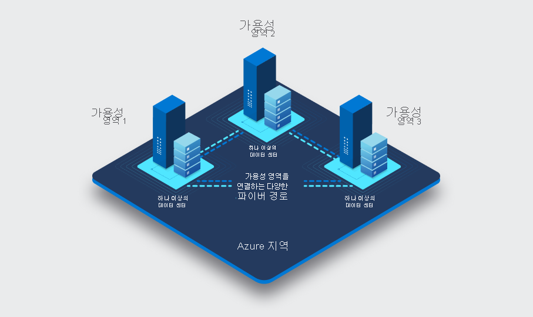

# Azure AI 검색 솔루션 유지 관리

## 1. 보안 관리

Azure AI Search는 고객의 민감 데이터를 색인하고 API로 제공하기 때문에 보안이 최우선 과제입니다. 다음 세 가지 축으로 구분해 살펴보겠습니다.

### 1.1 인증 및 권한 제어  
1) **Azure Active Directory(AAD) 통합**  
   - AAD 애플리케이션 등록 후 서비스 주체(Service Principal) 생성  
   - RBAC(Role-Based Access Control)로 역할(Role) 할당  
     -  `Search Data Contributor`: 색인 생성·수정 권한  
     -  `Search Indexer` 등 최소 권한만 부여  
   - **원칙**: 반드시 ‘최소 권한 원칙’을 적용해 불필요한 액세스를 차단 

2) **API 키 관리**  
   - **Primary Key / Secondary Key** 제공  
   - 키 재생(Regeneration) 주기를 정해 주기적으로 교체  
   - 키별 용도 분리  
     -  Key1: 프로덕션 읽기·쓰기  
     -  Key2: 개발·테스트 환경  

3) **Managed Identity 활용**  
   - 가상 머신, Azure Function 등에서 애플리케이션 자격 증명 없이 안전하게 호출  
   - AAD와 연동해 키 관리 부담 완화  

### 1.2 네트워크 방어  
1) **가상 네트워크(VNet) 서비스 엔드포인트**  
   - Azure Search 서비스에 VNet 엔드포인트 연결  
   - 퍼블릭 인터넷 트래픽을 방지하고 사설망을 통한 접근만 허용  
   

2) **Private Link 구성**  
   - 전용 프라이빗 IP로 Search 서비스에 연결  
   - Azure 리전 간 VNet 피어링 없이도 안전한 통신 가능  
   

3) **방화벽 및 IP 제한**  
   - 관리 포털 혹은 ARM 템플릿에서 허용 IP 범위 지정  
   - 운영팀·온프레미스 네트워크 IP만 허용  

### 1.3 데이터 암호화  
1) **전송 중 암호화(TLS/HTTPS)**  
   - 모든 클라이언트-서비스 통신에 HTTPS 강제 적용  
   - TLS 1.2 이상 사용  

2) **휴지 상태 데이터 암호화**  
   - Azure-managed key (기본) 혹은 고객 관리 키(CMK) 활용  
   - CMK: Azure Key Vault와 연동해 자체 키 제어  

3) **인덱스 백업 암호화**  
   - 스냅샷 백업 시 Azure Storage 계정의 암호화 옵션 확인  

***

## 2. 성능 최적화

검색 만족도를 결정하는 핵심 요소는 **응답 속도**와 **처리량**입니다. 인덱스 설계, 쿼리 구조, 서비스 스케일링 등 세 영역을 최적화해 보겠습니다.

### 2.1 인덱스 설계 최적화  
1) **필드 유형 최적화**  
   - `searchable`(텍스트 검색), `filterable`(필터), `sortable`(정렬), `facetable`(집계) 속성  
   - 사용하지 않을 속성은 제거해 색인 크기 축소  

2) **문서 크기 관리**  
   - 큰 JSON 문서는 분할(Chunking)  
   - 예: 제품 설명이 길다면 주요 키워드만 별도 필드로 추출  

3) **스코어링 프로필(Scoring Profile)**  
   - 사용자 경험에 맞춘 가중치(weight) 조정  
   - 검색 결과 순위 개선  

4) **복합 색인 키(Composite Key)**  
   - 파티셔닝(partitioning)이나 샤딩(sharding) 시 디자인 고려  

### 2.2 쿼리 튜닝  
1) **필터 우선 처리**  
   - `$filter` 절을 먼저 적용해 검색 대상 문서 집합을 줄임  
   - Scoring은 필터 후 최소 문서에 한해 실행  

2) **Projection (필드 선택)**  
   - `$select`로 필요한 필드만 반환  
   - 네트워크 왕복 데이터량 감소  

3) **검색 모드(Search Mode)**  
   - `all` vs `any` 설정  
   - `any`: 하나라도 매칭되면 OK → 빠르지만 정확도 ↓  
   - `all`: 모든 토큰 매칭 → 정확도 ↑, 속도 ↓  

4) **캐싱 전략**  
   - 정적 쿼리나 자주 조회되는 페이지에 대해 CDN 캐싱  
   - Application Gateway 후단에서도 캐싱 가능  

### 2.3 서비스 스케일링  
1) **Replica & Partition 조정**  
   - 읽기 부하 ↑: Replica 늘리기  
   - 데이터 볼륨 ↑: Partition 늘리기  

2) **자동 스케일링**  
   - Azure Functions나 Logic Apps로 모니터링 지표 연동  
   - 필요 시 Replica/Partition 인스턴스 자동 증감  

3) **성능 테스트**  
   - Azure Load Testing으로 실제 쿼리 패턴 기반 부하 시뮬레이션  
   - 병목 구간 식별 및 개선  

***

## 3. 비용 관리

클라우드 비용을 합리화하지 못하면 예산을 초과할 뿐 아니라 장기 운영에도 부담이 됩니다.

### 3.1 SKU 선택 전략  
1) **Free/Tier vs Standard vs Storage Optimized**  
   - PoC나 개발: Free/Tier  
   - 운영 환경: Standard (S1~S3)  
   - 데이터 용량 매우 큰 경우: Storage Optimized  

2) **스케일 밴드 이해**  
   - Partition·Replica 조합에 따라 시간당 비용 변화  
   - 운영 예산에 맞춰 최적 지점 선택  

3) **예약 인스턴스(Reserved Capacity)**  
   - 1년 또는 3년 예약으로 최대 55% 할인  

### 3.2 비용 모니터링 & 제어  
1) **Azure Cost Management**  
   - 예산(Alerts) 설정 후 초과 시 알림  
   - 비용 분석 뷰로 사용량 패턴 파악  
   

2) **리소스 태깅**  
   - `Environment=Prod/Dev`, `Team=Search` 등 태그 규칙 수립  
   - 팀·프로젝트별 비용 보고  

3) **비활성 색인·인덱서 정리**  
   - 사용 빈도 낮은 인덱스 삭제  
   - 일괄 스크립트로 주기 점검  

### 3.3 비용 절감 팁  
- **배치 업데이트**: 자주 소규모 문서 삽입 대신 배치 처리  
- **인덱서 스케줄**: 야간·주말 트래픽 적은 시간으로 조정  
- **모니터링 기반 조정**: 사용량 기준 Replica/Partition 축소  

***

## 4. 안정성 향상

서비스 중단 없이 SLA를 준수하고 장애 시 빠른 복구가 가능하도록 준비합니다.

### 4.1 고가용성(HA) 아키텍처  
1) **Geo-replication**  
   - Primary와 Secondary 지역 간 자동 페일오버  
   - DNS CNAME을 쓰면 절차 단순화  
   

2) **Replica 다중화**  
   - 최소 2개 이상 Replica 유지  
   - Replica 교체 시에도 읽기 서비스 지속  

### 4.2 장애 대응 및 복구  
1) **재시도 및 백오프(backoff)**  
   - 일시적 네트워크 오류 대비 재시도 로직 구현  
   - 지수 백오프(Exponential backoff) 전략 적용  

2) **인덱스 백업·복원**  
   - Azure Blob Storage에 주기적 스냅샷  
   - Azure CLI 또는 PowerShell 스크립트로 자동화  

3) **헬스체크(Health Check)**  
   - Application Insights에서 검색 응답 상태 확인  
   - 비정상 시 알림 및 자동 롤백  

***

## 5. 모니터링

운영 중인 검색 서비스의 상태를 실시간으로 파악하고 이상 징후를 조기에 발견합니다.

### 5.1 메트릭 기반 모니터링  
1) **Azure Monitor 지표**  
   - 검색 요청 수(Requests), 에러 비율(Error rate), 평균 응답 시간(latency)  
   - 파티션·Replica별 지표 세부 확인  
   

2) **커스텀 워크북(Workbook)**  
   - 팀별·서비스별 대시보드 구축  
   - 주요 지표 한눈에 모니터링  

### 5.2 로그 분석  
1) **Azure Log Analytics**  
   - 검색 쿼리 실패 로그, 인덱서 실행 로그 수집  
   - Kusto Query Language(KQL)로 심층 분석  

2) **Application Insights 연동**  
   - 사용자 쿼리별 성능 프로파일링  
   - 실패율이 높은 쿼리 패턴 도출  

### 5.3 알림 및 자동화  
1) **Alert Rules**  
   - 응답 시간 임계치 초과, 오류율 상승 시 이메일·웹훅 알림  
2) **Action Groups**  
   - PagerDuty·Microsoft Teams 연동  
   - 자동화된 스케일링·리커버리 스크립트 실행  

***

## 6. Azure Portal을 활용한 검색 문제 디버그

Azure Portal에서는 직접 검색 쿼리를 실행해보고, 인덱서 상태까지 한 번에 파악할 수 있습니다.

### 6.1 인덱스 탐색기(Index Explorer)  
1) **샘플 문서 조회**  
   - Preview 탭에서 색인된 문서 미리보기  
   - 쿼리 입력 후 결과 확인  

2) **스키마 검증**  
   - 필드 타입, 속성 누락·오타 체크  
   - 데이터 유형 불일치로 인한 오류 사전 발견  

### 6.2 인덱서 실행 내역  
1) **실행 기록(History)**  
   - 성공·실패 여부, 처리 문서 수, 소요 시간 확인  
2) **실패 상세 로그**  
   - Error message 클릭해 원인 추적  
   - 예: JSON 파싱 오류, 네트워크 타임아웃 등  

### 6.3 진단 설정(Diagnostic Settings)  
1) **메트릭·로그 전송**  
   - Log Analytics 워크스페이스, Event Hub, Storage 계정 선택 가능  
2) **테스트 API 호출**  
   - Portal의 “REST API” 탭에서 직접 GET/POST 호출  
   - Postman이나 curl로 실제 서비스 엔드포인트 점검  

***

### 마무리  
이상으로 Azure AI Search 솔루션의 **보안**, **성능**, **비용**, **안정성**, **모니터링**, **디버깅** 전 영역을 상세히 살펴보았습니다. 각 섹션의 체크리스트와 실천 방안을 따라 적용하면, 안정적이고 효율적인 검색 서비스를 운영할 수 있습니다.